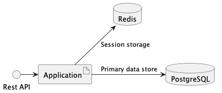

# Hotel Booking

## System architecture



## Module structure

Code is structured using a
[ports and adapters](https://codesoapbox.dev/ports-adapters-aka-hexagonal-architecture-explained/) pattern

Each module has its own README with more details & test/running instructions

**Application modules**

- `core` contains domain logic for the application
  - `test` contains unit tests of `core` classes
  - `integTest` contains behavioural tests with all components in `core` assembled, running against stubs for
downstream ports
- `ports` contains driving ports to invoke `core` logic and driven ports for `core` to invoke downstream adaptors
- `facade-rest` contains HTTP REST driving adaptor which exposes the application functionality. It also contains an
Open API spec for the REST interface.
  - `test` contains HTTP integration tests with driving ports stubbed. HTTP requests & responses are defined at a
low-level to show the message format & prove the API behaviour.
  - `contractTest` repeats the tests defined in `facade-test:test`, but makes calls using a client generated from the
Open API spec. This proves that the API implementation matches the Open API contract.
- `postgres-repository` contains the driven adaptor for PostgreSQL DB interactions
  - `test` contains DB integration tests run by invoking the adaptor interface. These tests depend on a PostgreSQL DB
running in Docker.
- `redis-repository` contains the driven adaptor for Redis DB interactions
  - `test` contains DB integration tests run by invoking the adaptor interface. These tests depend on a Redis DB
running in Docker.
- `app` integrates the domain logic & all of the adaptors. It is the entry point for the runnable application
  - `test` contains component tests against the entire assembled application. It triggers behaviour by invoking HTTP
endpoints, using a client generated from the Open API specification. It depends on PostgreSQL & Redis DBs running in
Docker.

**Utility modules**

- `postgres-migrations` contains SQL scripts to populate the DB & gradle tasks to help with executing the script/s
against a DB instance
- `rest-client` provides HTTP client interfaces generated from the REST Open API contract

## Linting

Linting performed by ktlint. Rule configs specified in `.editorconfig`

**Check lint**

```sh
./gradlew ktlintCheck
```

**Auto-apply lint fixes**

```sh
./gradlew ktlintFormat
```
